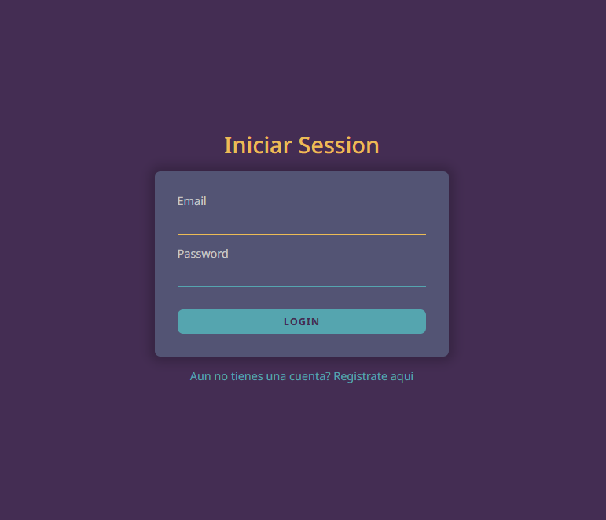
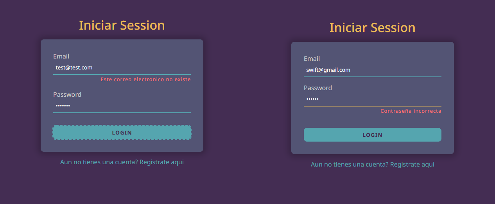
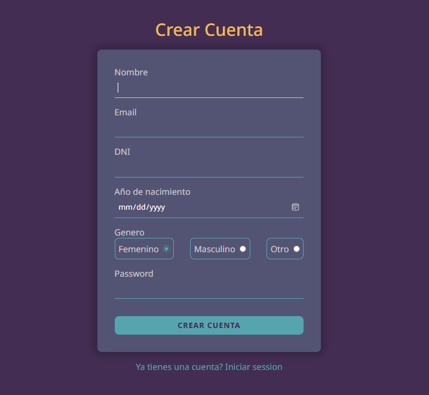
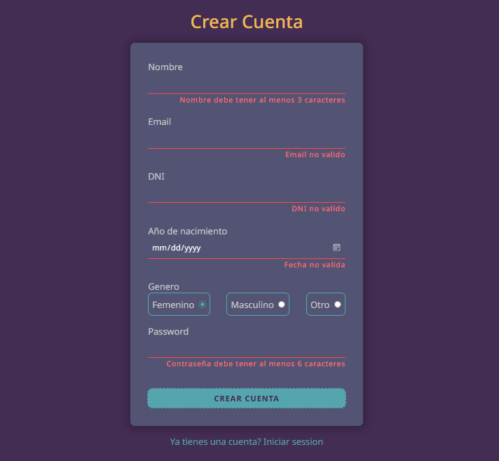
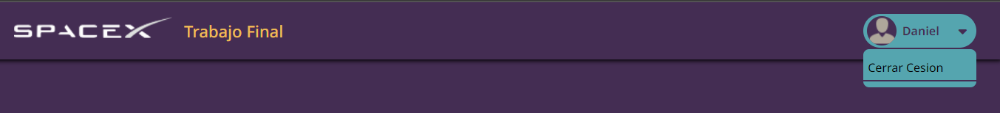

# Login and Registration Web App
## Welcome! 👋
This is a small web app to login into your account and also te create a new account. PHP is used for the backend.

> Final Work of Web Development II

## Used Technologies
* PHP
* Ajax
* JavaScript
* HTML
* CSS
* MySQL

## Screenshots
Login page

Login error actions page

Signup page

Signup error actions page

Logout button

## Author Daniel R. Ricra